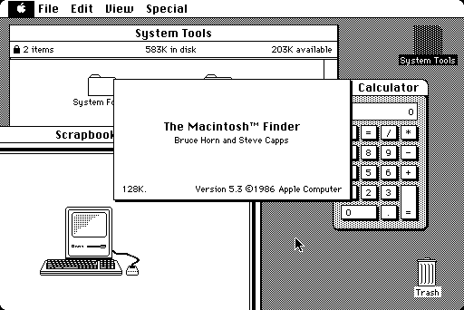

# Micro Mac (umac)

v0.21 26 August 2024

This is a minimalist Apple Macintosh 128K/512K emulator.  It uses the
_Musashi_ 68K interpreter and lashes the absolute minimum in hardware
emulation around it so as to boot and run basic apps.  It's been
tested with System 2.0 up to System 7.5.5, and runs MacWrite, MacDraw, and
Missile Command.  (For a Mac 128K, System 3.2 is the last OS that will
run, but by configuring 2MB+, even System 7 will work.)

You can write, draw, and unwind with an apocalyptic game.  Live well.



This was written as one of the old "hey I wonder how hard it'd be to"
exercises; bit of fun, but not intended as a replacement for existing
emulators.  But, it might inspire others working on similar (better)
projects, and as a basis to explore these early but innovative
machines.

This grew without a plan, just playing around with the Mac128K ROM: it
turns out that there's _very_ little HW emulation required to get to
an Unhappy Mac screen, or even an attempt to boot via FDD
(disc-question-mark screen).  Then, you discover IWM is way painful to
emulate, and spend 80% of the time working around that – almost all
Mac emulators immediately patch the ROM to insert a paravirt block
driver over the top of the IWM driver, circumventing the problem.
That's what _MicroMac_ does, too.

This emulates the following hardware:

  * VIA A/B GPIO ports, and IRQs (1Hz and Vsync)
  * VIA shift register for keyboard
  * SCC DCD pin change interrupts, for mouse
  * Paravirtualised disc storage
  * Defaults to 128K of RAM, but will run as a Mac 512K by building
    with `MEMSIZE=512`.  Or, you could use 1024, 2048, or 4096 to make
    a 1/2/4MB Mac Plus-like machine.  Straying off-piste a little, you
    can also use unsupported values like 256, 208, 192KB; when this is
    done, the ROM is patched to "probe" the correct memory size.

There's no emulation for:

  * IWM/realistic floppy drives
  * SCSI; the machine is sort of like a Mac Plus without SCSI.
  * More than one disc, or runtime image-switching
  * Sound (a lot of work for a beep)
  * VIA timers (Space Invaders runs too fast, probably because of this)
  * Serial/printer/Appletalk
  * Framebuffer switching: the Mac supports double-buffering by moving
    the base of screen memory via the VIA (ha), but I haven't seen
    anything using it.  Easy to add.

The emulator is structured so as to be easily embeddable in other
projects.  You initialise it, and pass in UI events (such as
keyboard/mouse), and read video from the framebuffer:

```
  umac_init(pointer_to_ram, pointer_to_patched_rom,
            pointer_to_struct_describing_mmaped_disc_images);

  while (happy) {
    if (one_second_passed)
      umac_1hz_event();

    if (vsync_happened_60Hz_kthx) {
      umac_vsync_event();

      update_UI_video_from(pointer_to_ram + umac_get_fb_offset());
    }

    if (keyboard_event_happened)
      umac_kbd_event(mac_scancode);

    if (mouse_movement_happened)
      umac_mouse(delta_x, delta_y, button_state);

    umac_loop();
  }
```

A simple SDL2-based frontend builds on Linux.


# Prerequisites

To build on Linux, you'll need `SDL2` installed (packaged as
`libsdl2-dev` on Ubuntu).

Musashi is included as a submodule, currently a custom branch with
some optimisations for static/tiny/fast builds.  `git submodule update --init`

You'll then need some Mac artefacts.  Because we need to patch the ROM
a little, we require specific versions.  Currently the only supported
ROM is _Mac Plus V3 ROM_, checksum `4d1f8172`.

(Note this makes this a _Mac 128Ke_, fancy!)

Then, get a boot disk.  Any System up to 3.2 should work fine on a 128K (though
I don't think I've tried 1.0).  I just tested a random German System 3.2 disc
from WinWorld and it works fine.  You might want to use Mini vMac or
Basilisk (i.e. a proper emulator) to prepare a disc image with some
apps to run...  MacDraw!

It doesn't have to be a specific size.  A 400K or 800K floppy image
works.  Make sure it's a raw image; the first two bytes should be the
chars 'LK'.  Some emulators append a header (which can be `dd`'d off).


# Build

```
make
```

No surprises here.  No autoconf either.  :D You can add a `DEBUG=1` to
make to compile in debug spew, and add `MEMSIZE=<size_in_KB>` to control
the amount of memory.

This will configure and build _Musashi_, umac, and `unix_main.c` as
the SDL2 frontend.  The _Musashi_ build generates a few files
internally:

  * `m68kops.c` is generated from templates in `m68k_in.c`: this
    "multiplies out" N instructions by the 200,000 addressing modes of
    68K, generating specialised code for each individual opcode.
  * Using a custom/new Musashi build option, a large (64K pointers)
    opcode lookup table is generated, 16-bit 68K opcode is generated
    at build time, as `m68ki_static_instruction_jump_table`.  This was
    previously generated at runtime, i.e. used up RAM.

After the _Musashi_ prepare step, `tools/decorate_ops.py` does an
in-place update of `m68kops.c` to decorate some of the opcode
functions with `M68K_FAST_FUNC`.  This macro does nothing by default,
but can be defined to apply a function attribute.  If this project is
being built in the RP2040 Pico environment, the functions gain an
attribute to place them in RAM instead of flash – making them much
faster.

Some low-quality (so uncommitted) and undocumented profiling code was
used to generate the `tools/fn_hot200.txt` list of the 200 most
frequently-used 68K opcodes.  This was generated by profiling a System
3.2 boot, using MacWrite and Missile Command for a bit.  :D Out of
1967 opcodes, these hottest 200 opcodes represent 98% of the dynamic
execution.  (See _RISC_.)


# Running

```
./main -r <path_to_MacPlusV3_rom> -d <path_to_disc_image>
```

The RAM is actually a memory-mapped file, which can be useful for
(basic) debugging: as the emulator runs, you can access the file and
see the current state.  For example, you can capture screenshots from
screen memory (see `tools/mem2scr.c`).

For a `DEBUG` build, add `-i` to get a disassembly trace of execution.

Finally, the `-W <file>` parameter writes out the ROM image after
patches are applied.  This can be useful to prepare a ROM image for
embedded builds, so as to avoid having to patch the ROM at runtime.
That then means the ROM can be in immutable storage (e.g. flash),
saving precious RAM space.

# Hacks/Technical details

If you're writing an emulator for an olden Mac, some
pitfalls/observations:

  * The ROM overlay at reset changes the memory map, and the address
    decoding for read/write functions has to consider this.  Overlay
    is on for only a handful of instructions setting up RAM exception
    vector tables so, for performance to avoid checking on every
    access, there should be two versions of memory read/write
    functions that are selected when the overlay changes.  This has
    been implemented only for instruction/opcode fetch.

  * IWM is a total pig to emulate, it turns out.  There's some kind of
    servo loop controling the variable rotation speed via PWM (a DAC!),
    and the driver/IWM vary it for a particular track until the syncs
    look about right... too little fun for a Sunday.

  * The disc device emulation is a cut-down version of Basilisk II's
    disc emulation code: A custom 68K driver (in `macsrc/sonydrv.S`,
    based on B2's driver code) is patched into the ROM, and makes
    accesses to a magic `PV_SONY_ADDR` address.  These are then
    trapped so that when the Mac OS makes a driver call
    (e.g. `Open()`, `Prime()`, `Control()`, `Status()`) the call is
    routed to host-side C code in `disc.c`.  The emulation code
    doesn't support any of the advanced things a driver can be asked
    to do, such as formatting – just read/write of a block.
    The read/write can be performed internally, by passing a pointer
    to an in-memory mapping of the disc data (e.g. `unix_main.c` just
    `mmap()`s the disc); or, `op_read`/`op_write` callbacks can be
    used for when a host disc op needs to be performed.
    When the disc is asked to be ejected, a `umac` callback is called;
    currently this just exits the emulator.  The beginnings of
    multi-disc support are there, but not enabled – again, bare
    minimum to get the thing to boot.

  * The high-precision VIA timers aren't generally used by the OS,
    only by sound (not supported) and the IWM driver (not used).
    They're not emulated.

  * The OS's keyboard ISR is easy to confuse by sending bytes too fast,
    because a fast response's IRQ will race with the ISR exit path and
    get lost.  The `main.c` keyboard emulation paces replies
    (`kbd_check_work()`, `kbd_rx()`) so as to happen a short time
    after the Mac sends an inquiry request.

  * Mouse: The 8530 SCC is super-complicated.  It's easy to think of
    the 1980s as a time of simple hardware, but that really applies
    only to CPUs: to compensate, the peripheral hardware was often
    complex, and SCC has a lot of offloads for packetisation/framing
    of serial streams.  It is this chip that enables AppleTalk,
    relatively high-speed packet networking over RS422 serial cables.
    Two spare pins (for port A/B DCD detect) are used by the mouse;
    the Mac 128K is a nose-to-tail design, no part of the animal is
    wasted.  Uh, anyway, only enough of the SCC is supported to make
    the mouse work: IRQ system for DCD-change, driven from one half of
    a quadrature pair on X/Y.  The ISR for those lines then samples
    the VIA PORTB pins for the corresponding other half of the pair.
    Finally, the emulator interface takes a movement delta dx:dy for
    convenience; a quadrature step is performed for each unit over a
    period of time.

  * I didn't use the original Mac128 ROM.  First, Steve Chamberlin has
    done a very useful disassembly of the MacPlus ROM (handy to
    debug!) and secondly I misguidedly thought that more stuff in ROM
    meant more RAM free.  No, the 128K MacPlus ROM uses more RAM (for
    extra goodies?) than the original 64K Mac 128K ROM.  It does,
    however, have some bug fixes.  Anyway: the MacPlus ROM runs on
    512K and 128K Macs, and was used as the 'e' in the Mac 512Ke.


# See also

  * <https://github.com/kstenerud/Musashi>
  * <https://www.bigmessowires.com/rom-adapter/plus-rom-listing.asm>


# License(s)

The basis for the 68K `sonydrv.S` and host-side disc driver code in
`disc.c`/`b2_macos_util.h` (as detailed in those files) is from
Basilisk II, Copyright 1997-2008 Christian Bauer, and released under
GPLv2.

The `keymap.h` and `keymap_sdl.h` headers are based on Mini vMac
OSGLUSDL.c Copyright (C) 2012 Paul C. Pratt, Manuel Alfayate, and
OSGLUAAA.h Copyright (C) 2006 Philip Cummins, Richard F. Bannister,
Paul C. Pratt, released under GPLv2.

Some small portions of `main.c` (debug, interrupts) are from the
_Musashi_ project's `example/sim.c`.  _Musashi_ is Copyright 1998-2002
Karl Stenerud, and released under the MIT licence.

The remainder of the code is released under the MIT licence:

 Copyright (c) 2024 Matt Evans

 Permission is hereby granted, free of charge, to any person obtaining a copy
 of this software and associated documentation files (the "Software"), to deal
 in the Software without restriction, including without limitation the rights
 to use, copy, modify, merge, publish, distribute, sublicense, and/or sell
 copies of the Software, and to permit persons to whom the Software is
 furnished to do so, subject to the following conditions:

 The above copyright notice and this permission notice shall be included in all
 copies or substantial portions of the Software.

 THE SOFTWARE IS PROVIDED "AS IS", WITHOUT WARRANTY OF ANY KIND, EXPRESS OR
 IMPLIED, INCLUDING BUT NOT LIMITED TO THE WARRANTIES OF MERCHANTABILITY,
 FITNESS FOR A PARTICULAR PURPOSE AND NONINFRINGEMENT. IN NO EVENT SHALL THE
 AUTHORS OR COPYRIGHT HOLDERS BE LIABLE FOR ANY CLAIM, DAMAGES OR OTHER
 LIABILITY, WHETHER IN AN ACTION OF CONTRACT, TORT OR OTHERWISE, ARISING FROM,
 OUT OF OR IN CONNECTION WITH THE SOFTWARE OR THE USE OR OTHER DEALINGS IN THE
 SOFTWARE.
